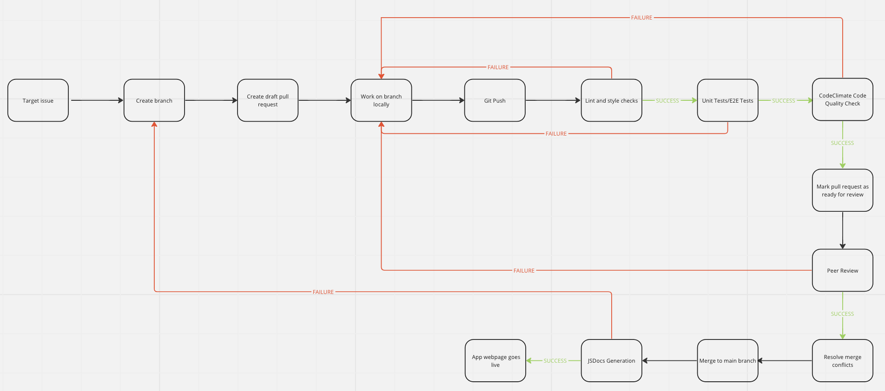

# Pipeline Status

## Functional:
- Lint and code style enforcement (run `npm lint-fix` in editor).
- Codeclimate quality checker
- Code quality human reviewer for PR
- Jest/Puppeteer testing via automation
- JSDocs generation via automation to seperate repo
